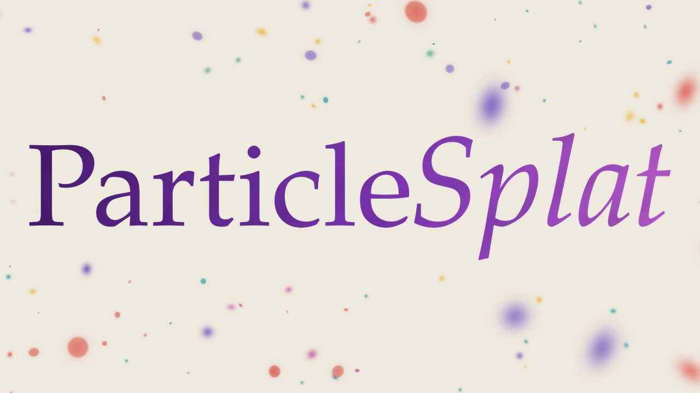

<h1 align="center">ParticleSplat</h1>
<h3 align="center">Self-supervised Object-centric Latent Particle Splatting</h3>

  Lyuxing He · Daniel Guo · Elizabeth Terveen · Deepak Pathak · David Held · Tal Daniel

  Robotics Institute, Carnegie Mellon University

  <a href="https://lyuxinghe.github.io/ParticleSplat-website/"><strong>Project Website</strong></a>
  &nbsp;·&nbsp;
  <a href="https://arxiv.org/abs/2609.19463"><strong>Paper</strong></a>

  

Official repository for **ParticleSplat**.

> **Code release coming soon.** We are preparing the public release.
